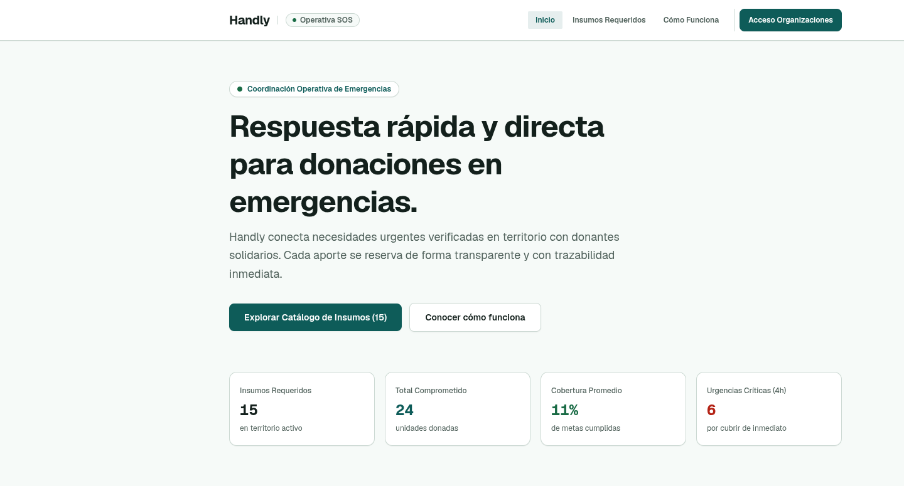

# Handly

Coordinación de donaciones en emergencias. Un donante entra sin cuenta, explora las necesidades de una campaña, compromete una cantidad y recibe su comprobante `SOS-XXXX`. El equipo operativo gestiona campañas y necesidades desde un panel de operaciones calmo y de alto contraste.



> Producto: **Handly**. Repositorio: `handly` (anteriormente `coderhub`).

## Inicio rápido

Requisitos: Node 20+ · pnpm 11 (incluido en `packageManager`; con corepack activo se usa solo).

1. Copia `.env.example` a `.env.local` y completa las variables requeridas (si falta una, la app falla al arrancar):

   | Variable | Descripción |
   | --- | --- |
   | `SUPABASE_URL` | URL de la API de tu proyecto Supabase |
   | `SUPABASE_ANON_KEY` | Clave anónima (pública) del proyecto |
   | `SITE_URL` | URL base del sitio; debe coincidir con la URL por la que el navegador accede (usada en redirects) |

   Valores de Supabase: <https://supabase.com/dashboard/project/_/settings/api>

2. Instala y levanta:

   ```bash
   pnpm install # también instala los hooks de lefthook (script prepare)
   pnpm dev
   ```

3. Abre [http://localhost:3000](http://localhost:3000).

Las tres variables anteriores se validan server-side en `src/lib/env.ts`. Las variables opcionales de integraciones (NVIDIA NIM, Make, Resend) están documentadas con comentarios en el propio `.env.example`.

## Stack

Next.js 16 · React 19 · Tailwind CSS 4 · TypeScript 5 (strict) · pnpm · Supabase (`@supabase/ssr`) · Zod 4 · TanStack Table · Vercel AI SDK + NVIDIA NIM.

## Estructura

```
app/        Rutas App Router: flujo donante (campaign, needs) y operaciones (dashboard, onboarding, auth)
src/        components · features · lib · styles compartidos
supabase/   Migraciones, seed y configuración local
docs/       Arquitectura, diseño e integraciones (Make)
DESIGN.md   Tokens y sistema visual canónicos (owner file)
```

## Calidad (Ultracite + Oxlint/Oxfmt) — para todos, técnico o no

Los hooks corren solos tras `pnpm install` (`prepare` → `lefthook install`). No necesitas hacer nada manual en el día a día:

- **Commit:** auto-fix sobre los archivos staged (`npx ultracite fix`) y se re-stagean solos.
- **Push:** `npx ultracite check` + `pnpm tsc --noEmit`. Si hay errores, el push se bloquea.
- **Si te bloqueó el push:** corre `pnpm lint` (muestra los problemas), `pnpm format` (los arregla), vuelve a commitear.
- **Chequeo completo manual:** `pnpm ultracite:check && pnpm tsc --noEmit && pnpm build`.
- **Formato:** `npx oxfmt --check .` debe dar 0 errores (ya está en 0 en `main`).

## Documentación

- [Propuesta de arquitectura](docs/architecture/PROPUESTA_ARQUITECTURA.md)
- [Integración Make (despacho de emails)](docs/integrations/make/)
- [Sistema de diseño Stitch](docs/design/stitch/) — tokens OKLCH y tipografía Geist vía `next/font`; detalle completo en [`DESIGN.md`](DESIGN.md) y specs activas en `openspec/specs/`
- [Licencia](LICENSE)
