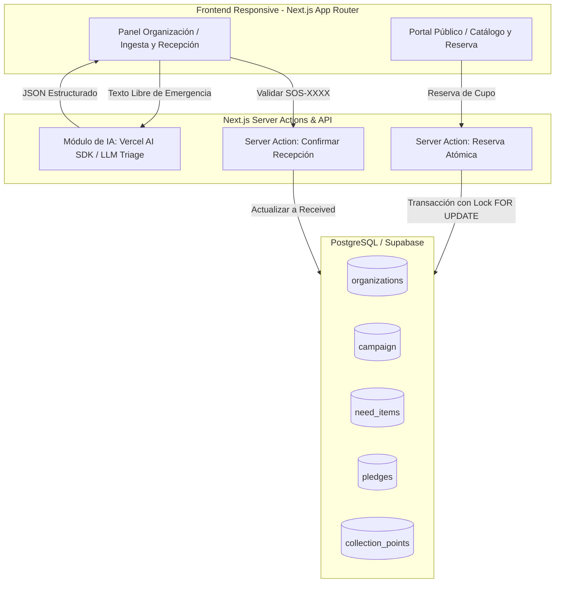
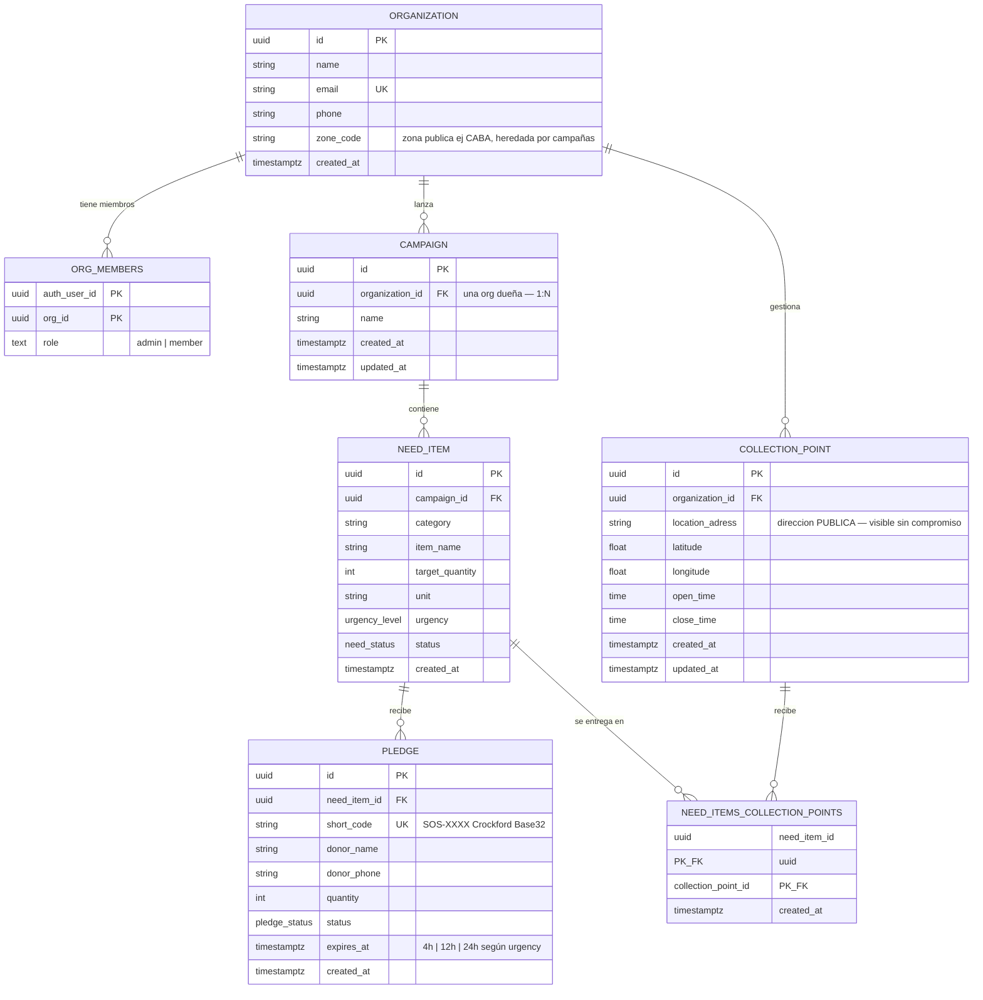

# Propuesta de Arquitectura y Producto MVP: Handly (1 Semana)

Plataforma de Coordinación de Donaciones en Emergencias con Ingesta y Priorización Asistida por Inteligencia Artificial.

> **Naming:** El producto es **Handly**. _Triage_ nombra solo la feature interna de clasificación asistida por IA (ingesta de necesidades), no el producto.

---

## 1. Resumen Ejecutivo y Enfoque

En situaciones de emergencia humanitaria o desastres naturales, el principal cuello de botella es la **descoordinación logística**: sobre-donación de insumos no prioritarios y desabastecimiento crítico de recursos vitales.

**Handly** resuelve este problema mediante dos pilares:

1. **Asistente de Ingesta y Triage con IA:** Permite a los operadores en terreno cargar pedidos en lenguaje natural (texto o voz transcrita). El modelo clasifica automáticamente categoría, cantidades estandarizadas y nivel de urgencia en segundos.
2. **Motor Transaccional de Cupos Justos:** Bloqueo atómico de reservas para evitar sobre-donaciones, con expiración dinámica por urgencia y validación rápida en centros de acopio sin fricción de contraseñas.

---

## 2. Alcance del MVP (5 Días Hábiles)

### Módulos Incluidos (In-Scope)

1. **AI Triage & Ingesta Rápida (Organizaciones):**
   - Entrada de texto libre: el operador describe la necesidad y la IA genera el requerimiento estructurado (`category`, `item_name`, `target_quantity`, `unit`, `urgency`).
   - Resumen contextual generado por IA para donantes sobre las prioridades activas en cada zona.
2. **Portal Público de Necesidades:**
   - Visualización de metas y progreso en tiempo real (Comprometido vs. Recibido).
   - Filtros normalizados por Zona predefinida, Categoría y Urgencia.
3. **Flujo de Donación sin Fricción (Guest Checkout):**
   - El donante selecciona cantidad disponible y sus datos de contacto.
   - Generación de código corto legible (ej: `SOS-7X9K`, sin caracteres ambiguos).
4. **Control de Concurrencia y TTL Dinámico:**
   - Reserva atómica (`SELECT ... FOR UPDATE`) desde Server Actions en PostgreSQL.
   - Expiración pasiva (_lazy expiration_) adaptada al nivel de urgencia: **4h** (Crítico), **12h** (Urgente), **24h** (Estándar).
5. **Mesa de Recepción en Acopio:**
   - Búsqueda por código corto para confirmar ingreso físico con un clic o registrar recepciones presenciales tolerantes.
6. **Autenticación Básica de Organizaciones:**
   - Login por email y contraseña (Supabase Auth) para administración de pedidos y acopio.

### Funcionalidades Postergadas (Fase 2)

- Perfiles y registro obligatorio para donantes particulares.
- Infraestructura de Redis / colas de mensajería asíncronas pesadas.
- Notificaciones por WhatsApp / SMS externas.
- Mapas interactivos con PostGIS / geolocalización por radio.
- Escaneo por cámara web/PWA offline.

---

## 3. Arquitectura del Sistema



| Capa                        | Tecnología                           | Propósito en el MVP                                                                      |
| :-------------------------- | :----------------------------------- | :--------------------------------------------------------------------------------------- |
| **Framework Fullstack**     | Next.js (App Router, Server Actions) | Frontend reactivo y backend en una sola base de código con SSR.                          |
| **Inteligencia Artificial** | Vercel AI SDK + OpenAI / Gemini      | Extracción estructurada (_Structured Outputs / Tool Calling_) del triage de necesidades. |
| **Estilos y UI**            | Tailwind CSS + Lucide Icons          | Interfaz móvil limpia, rápida y de alto impacto visual para la demo.                     |
| **Base de Datos**           | PostgreSQL (Supabase / Neon)         | Transacciones ACID, integridad referencial y autenticación integrada.                    |

---

## 4. Modelo de Datos Relacional



> **Nota de modelado (MVP):** `campaign.organization_id` es **1:N** (una campaña pertenece a una sola organización). El catálogo público muestra múltiples campañas —incluso de distintas organizaciones para el mismo evento (ej. terremoto Colombia)— y el donante compara por punto de entrega más cercano. `public_zone` no existe: `collection_points.location_adress` es **pública** por diseño. `zone_code` vive en `organizations` y se hereda; no se duplica en `campaign`. Colaboración N:M entre organizaciones en una misma campaña (`campaign_organizations`) queda como **Fase 2**.

**Flujo canónico (acordado):** `Organización → Campaña → Ítems` (asociando `collection_points`). El formulario de ítem ofrece como **atajo opcional** el botón `+ Nueva campaña` (solo `admin`) para no salir del flujo, pero el flujo principal es crear la campaña primero y luego sus ítems.

### Definición DDL (PostgreSQL)

```sql
-- Tipos personalizados / Enums
CREATE TYPE urgency_level AS ENUM ('critical_4h', 'urgent_12h', 'standard_24h');
CREATE TYPE need_status AS ENUM ('active', 'fulfilled', 'cancelled');
CREATE TYPE pledge_status AS ENUM ('pending', 'received', 'cancelled');

-- Tabla de Organizaciones
CREATE TABLE organizations (
    id UUID PRIMARY KEY DEFAULT gen_random_uuid(),
    name VARCHAR(255) NOT NULL,
    email VARCHAR(255) UNIQUE NOT NULL,
    phone VARCHAR(50) NOT NULL,
    zone_code VARCHAR(50),
    created_at TIMESTAMPTZ DEFAULT NOW()
);

-- Tabla de Miembros de Organización
CREATE TABLE org_members (
    auth_user_id UUID NOT NULL,
    org_id UUID NOT NULL REFERENCES organizations(id) ON DELETE CASCADE,
    role TEXT NOT NULL,
    PRIMARY KEY (auth_user_id, org_id)
);

-- Tabla de Campañas
CREATE TABLE campaign (
    id UUID PRIMARY KEY DEFAULT gen_random_uuid(),
    name TEXT NOT NULL,
    organization_id UUID NOT NULL REFERENCES organizations(id) ON DELETE CASCADE,
    created_at TIMESTAMPTZ NOT NULL DEFAULT NOW(),
    updated_at TIMESTAMPTZ NOT NULL DEFAULT NOW()
);

-- Tabla de Ítems Necesitados
CREATE TABLE need_items (
    id UUID PRIMARY KEY DEFAULT gen_random_uuid(),
    campaign_id UUID REFERENCES campaign(id) ON DELETE SET NULL,
    category VARCHAR(100) NOT NULL,
    item_name VARCHAR(255) NOT NULL,
    target_quantity INT4 NOT NULL CHECK (target_quantity > 0),
    unit VARCHAR(50) NOT NULL,
    urgency urgency_level NOT NULL,
    status need_status NOT NULL,
    created_at TIMESTAMPTZ DEFAULT NOW()
);

-- Tabla de Puntos de Acopio / Recolección
-- Nota: location_adress es PÚBLICA por diseño (visible en catálogo sin compromiso).
-- No existe public_zone; zona se hereda de organizations.zone_code.
CREATE TABLE collection_points (
    id UUID PRIMARY KEY DEFAULT gen_random_uuid(),
    organization_id UUID NOT NULL REFERENCES organizations(id) ON DELETE CASCADE,
    location_adress TEXT NOT NULL,
    latitude FLOAT8,
    longitude FLOAT8,
    open_time TIME,
    close_time TIME,
    created_at TIMESTAMPTZ NOT NULL DEFAULT NOW(),
    updated_at TIMESTAMPTZ NOT NULL DEFAULT NOW()
);

-- Tabla Pivote (Muchos a Muchos entre need_items y collection_points)
CREATE TABLE need_items_collection_points (
    need_item_id UUID NOT NULL REFERENCES need_items(id) ON DELETE CASCADE,
    collection_point_id UUID NOT NULL REFERENCES collection_points(id) ON DELETE CASCADE,
    created_at TIMESTAMPTZ NOT NULL DEFAULT NOW(),
    PRIMARY KEY (need_item_id, collection_point_id)
);

-- Tabla de Compromisos / Promesas de Donación
CREATE TABLE pledges (
    id UUID PRIMARY KEY DEFAULT gen_random_uuid(),
    need_item_id UUID NOT NULL REFERENCES need_items(id) ON DELETE CASCADE,
    short_code VARCHAR(50) UNIQUE NOT NULL,
    donor_name VARCHAR(255) NOT NULL,
    donor_phone VARCHAR(50) NOT NULL,
    quantity INT4 NOT NULL CHECK (quantity > 0),
    status pledge_status NOT NULL,
    expires_at TIMESTAMPTZ NOT NULL,
    created_at TIMESTAMPTZ DEFAULT NOW()
);

-- Índices sugeridos para optimización de consultas
CREATE INDEX idx_need_items_campaign ON need_items(campaign_id);
CREATE INDEX idx_need_items_status ON need_items(status, urgency);
CREATE INDEX idx_pledges_need_item ON pledges(need_item_id, status, expires_at);
CREATE INDEX idx_pledges_short_code ON pledges(short_code);
```

---

## 5. Lógica de Negocio y Reglas Clave

### A. Triage de Requerimientos con IA

Prompt del sistema estructurado con schema Zod para garantizar tipado estricto:

- **Entrada del operador:** _"Nos urgen 40 bidones de agua de 5L y 20 cajas de gasas en el Albergue Central antes del anochecer"_.
- **Salida del LLM:**
  ```json
  [
    {
      "category": "Agua y Alimentos",
      "item_name": "Agua Potable (Bidones 5L)",
      "target_quantity": 40,
      "unit": "bidones",
      "urgency": "critical_4h"
    },
    {
      "category": "Salud y Primeros Auxilios",
      "item_name": "Gasas estériles",
      "target_quantity": 20,
      "unit": "cajas",
      "urgency": "critical_4h"
    }
  ]
  ```

### B. TTL Dinámico según Urgencia

El cálculo de expiración se fija al momento de la reserva según la urgencia del ítem:

- `critical_4h` $\rightarrow$ `expires_at = NOW() + INTERVAL '4 hours'`
- `urgent_12h` $\rightarrow$ `expires_at = NOW() + INTERVAL '12 hours'`
- `standard_24h` $\rightarrow$ `expires_at = NOW() + INTERVAL '24 hours'`

### C. Reserva Atómica en Server Action (Transacción Segura)

1. Inicia transacción con aislamiento de lectura.
2. Bloquea la fila del ítem (`SELECT target_quantity FROM need_items WHERE id = $1 FOR UPDATE`).
3. Suma los cupos vigentes: `status = 'received' OR (status = 'pending' AND expires_at > NOW())`.
4. Si `cupo_solicitado <= cupo_disponible`: inserta el registro en `pledges` con código corto tipo `SOS-84K2` (alfabeto Crockford Base32 para evitar confusiones de lectura).

---

## 6. Cronograma de Desarrollo y Entregables (5 Días)

| Día       | Foco Principal                        | Tareas Clave                                                                                                                                             |
| :-------- | :------------------------------------ | :------------------------------------------------------------------------------------------------------------------------------------------------------- |
| **Día 1** | **Setup, Schema & IA Triage**         | Inicialización del proyecto Next.js, conexión a Supabase, migración DDL y endpoint/Server Action de ingesta con LLM (Vercel AI SDK + Zod).               |
| **Día 2** | **Portal Público & Flujo de Reserva** | Catálogo público con filtros de zona/urgencia, visualización de progreso y modal de compromiso con transacción `FOR UPDATE` + generación de `SOS-XXXX`.  |
| **Día 3** | **Panel de Organización & Recepción** | Login con Supabase Auth, formulario con asistente IA integrado y mesa de recepción para validación de códigos de donación.                               |
| **Día 4** | **Pulido de UX, Mobile & Deploy**     | Revisión mobile-first, seed de datos realistas para la demo, testing de flujos punta a punta y deploy a producción (Vercel + Supabase).                  |
| **Día 5** | **Video Pitch (2 min) & Postulación** | **Slot prioritario:** Redacción de guión de 2 minutos, grabación de pantalla y pitch, edición ágil, publicación en redes y envío del formulario oficial. |
